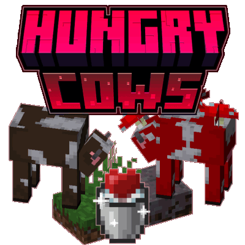

#  
&emsp;&emsp;&emsp; Hungry Cows  <a title="Hungry Cows on Curseforge" href="https://www.curseforge.com/minecraft/mc-mods/hungrycows"></a> 

   

###  Compatibility

<table>
  <thead>
    <tr>
      <td><strong>Minecraft</strong></td>
      <td>
        <a href="https://modrinth.com/mod/hungrycows/versions?g=1.20.1"><code>1.20.1</code></a> 
        <a href="https://modrinth.com/mod/hungrycows/versions?g=1.21&g=1.21.1"><code>1.21(.1)</code></a>, <a href="https://modrinth.com/mod/hungrycows/versions?g=1.21.4&g=1.21.5&g=1.21.6&g=1.21.7&g=1.21.8&g=1.21.9&g=1.21.10?g=1.21.11"><code>1.21.4</code>~<code>1.21.11</code></a>
      </td>
    </tr>
  </thead>
  <tbody>
    <tr>
      <td><strong>Mod Loaders</strong></td>
      <td><a href="https://fabricmc.net/use/installer/"><code>Fabric Loader</code></a></td>
    </tr>
  </tbody>
  <thead>
    <tr>
      <td><strong>Requires</strong></td>
      <td>
        <a href="https://modrinth.com/mod/fabric-api"><code>Fabric API</code></a>
      </td>
    </tr>
  </thead>
  <tbody>
    <tr>
      <td><strong>Added support</strong></td>
      <td>
        <a href="https://modrinth.com/mod/jade"><code>Jade</code></a> 
        <a href="https://modrinth.com/mod/fresh-animations"><code>Fresh Animations 1.10.3</code></a> 
      </td>
    </tr>
  </tbody>
</table>
 

### Features:

|| **Feature**                                                                                                         |  `Cow` |  `Mooshroom` |  `Goat` |    `Sheep`   | ⚙️ _Configurable?_                      |
|:-:|---------------------------------------------------------------------------------------------------------------------|:------:|:-----------:|:------:|:------------:|:----------------------------------------|                                                                                                            
|| **Eating Grass and some Plant Blocks restores _Milkability_ and health**                                            | ✅ | ✅ (Eats Mycelium) | ❌ (Can only be fed) |   ✅ (for Wool)   | ✅ (Probability, Baby Growth, Healing, Plant Blocks via tags)   |
|| **Milk restores Hunger & Saturation,  + stacks up to 16**                                            | ✅ | ✅ | ✅ |              | ✅ (Nutritional values per milk type)    |
|| **Can be fed to regain _Milkability_  + to restore 1 ❤ (Note: Feeding has a 5 min cooldown by default.)** | ✅ | ✅ | ✅ | ✅ (for Wool) | ✅ (Feedable items per animal, cooldown) |
|| **Dispensers can milk**                                                                                             | ✅ | ✅ (+ with Bowls) | ✅ |              | ❌                                       |
|| **Show _Milkability_ through Model & Texture**                             | ✅ | ✅ | ❌ |             | ✅                                       |
|| **Jade shows _Milkability_ and _Feedability_ status**                                                               | ✅ | ✅  (+ Flower for Suspicious Stew) | ✅ |      ✅ (Feedability)       | ✅ (Jade not required, toggleable each)  |

   

###  Translations

Currently available in:
- English
- German
- Brazilian Portuguese (@[demorogabrtz](/../../../../demorogabrtz) with [PR #11](../../pull/1), added in [`2.1.0`](./CHANGELOG_history.md#2.1.0))

> [!NOTE]
> > Want to help translate? If you can, please open a PR to the **default branch** [`1.21(.1)`](../../tree/1.21(.1)).  
> > Otherwise, simply send your translation via email (contact@pnku.de) or join the [Discord](https://discord.lieonlion.dev).

 

  

### Versions

<!--CHANGELOG:START-->

#### 2.2.1[*](#footnote-*):
- Update <ins>Fresh Animations</ins> (&#x200A;<!--SEPARATOR_V-->&#x200A;) compatibility pack to `1.10.4`
- `1.20.1`:
  - Fixes crash due to incompatibility with Java 17
  - Fixes _Fresh Animations_ compatibility pack appearing incompatible 
    > ("Made for a newer version of Minecraft")
  - Fixes one of Goats' default feedable items (_Short Grass_) not being feedable
  - Fixes Goats not following the player when holding an item that can be used to feed a goat
    > **_Note_**:  
    This feature is restricted to Items in the `#hungrycows:goat_feedable` tag due to limitations specific to the Goat behavior logic in <ins>1.20.1</ins>.  
  This tag used to be empty by default to let the config take precedence, but due to the issues described above, it now includes the default feedable items: _Wheat_ and _Short Grass_.  
    You can still feed _Goats_ to restore _Milkability_ even with items set by the config, they simply won't follow you when holding them unless they are in the tag.

  
License update to [CC-BY-NC-SA 4.0](https://creativecommons.org/licenses/by-nc-sa/4.0/) (previously [MIT](https://opensource.org/licenses/MIT))

<h2><ins>Download 2.2.1 + 1.21.4</ins>:&#x200A;

</h2>

<!--CHANGELOG:END-->

> <strong>*</strong>: Most recent version  
> _`The version above is automatically updated with the newest release and only after it has been successfully published.`_

> [!TIP]
> > Looking for changes of previous versions?  
> > You can find them in the [changelog history](./CHANGELOG_history.md).

---
#### Support/Contact
- Suggestions? Questions? Bug reports?  
  Feel free to [open an issue](/../../issues)!  
  &nbsp;  
  You can also contact me via email at [contact@pnku.de](mailto:contact@pnku.de) or join the [Discord](https://dsc.lieonlion.dev) and contact me there.
